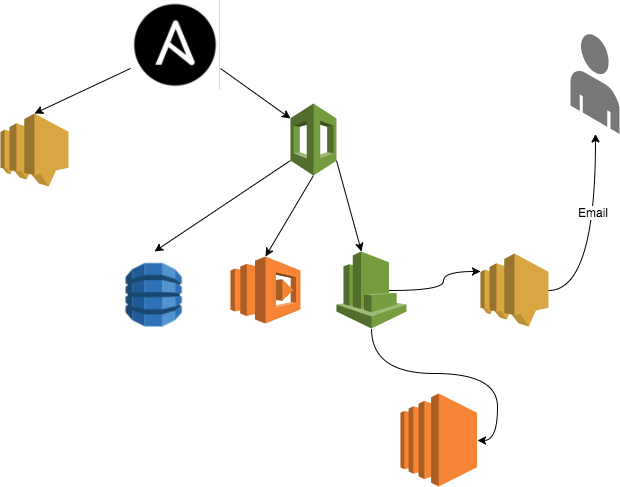

*Ansible-Lambda-SNS-CF*
-
EC2 Scheduler
-
 **Introduction**

The EC2 Scheduler leverages Amazon EC2 resource tags and AWS Lambda to automatically stop and restart Amazon EC2 instances

**Architecture Overview**

Automatic deployment of this solution configures the following components and functionality.

 **Design**

The Ansible, creates the AWS SNS and the CloudFormation template sets up an Amazon CloudWatch event at a customer- defined interval. This event invokes the EC2 Scheduler AWS Lambda function. During configuration, the user defines default start and stop parameters (in UTC) as well as a custom tag that the EC2 Scheduler will use to identify applicable Amazon EC2 instances. These values are stored in Amazon DynamoDB, and the Lambda function retrieves them each time it runs. The customer then applies the custom tag to applicable Amazon EC2 instances.

**Ansible Vars**

First, edit the parameters in the file "ec2scheduler/vars/main.yml" 
- ec2_access_key
- ec2_secret_key
- aws_region
- sns_topic
- cf_tmp_location
- stack_name

Now you can run the "Ansible-playbook" and all the components will be installed automatically.
